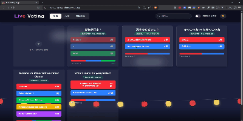

# Live Voting App

[](https://live-voting-app-demo.vercel.app/)
[](https://nextjs.org/)
[](https://supabase.com/)
[](https://opensource.org/licenses/MIT)

**公開URL**: [https://live-voting-app-demo.vercel.app/](https://live-voting-app-demo.vercel.app/)

---

## 概要
「Live Voting App」は、ユーザーが作成した対決テーマに対して、世界中の人々がリアルタイムで投票・参加できるインタラクティブな投票プラットフォームです。
単に意見を集計するだけでなく、「誰かが投票した瞬間に画面全体が反応する」というライブ体験（UX）を極限まで追求し、視覚的な楽しさと即時性を両立させました。

### 開発の背景・経緯
現代のSNSやアンケートツールでは、意思決定や意見の集約が「非同期」で行われることが多く、「今、この瞬間に意見が交わされ、盛り上がっている」という熱量を感じにくいという課題がありました。
そこで、「簡単にみんなの意見を収集し、一目で全体の傾向がわかる」という実用性に加え、**「ユーザーのアクションが即座に光やアニメーションとなって全ユーザーの画面に波及する」** という、一体感を生み出すウェブアプリを自ら企画・開発しました。

---

## 特徴と機能の説明

### スクリーンショット（ギャラリー）
| トップダッシュボード | 投票作成フロー |
| :---: | :---: |
|  |  |
| **リアルタイム同期と演出** | **検索機能** |
|  |  |
| **ソート機能** | **モバイル表示 (PWA)** |
|  |  |

### 主な機能

#### 1. 核心機能: ゼロ・レイテンシー投票体験
*   **リアルタイム相互同期 (Real-time Synchronization)**
    *   ページリロードは一切不要です。他ユーザーの投票アクションが、ミリ秒単位の遅延で自分の画面のプログレスバーに反映されます。
    *   **Optimistic UI (楽観的UI更新)**: ネットワークのレスポンスを待たずにUIを先行更新することで、ネイティブアプリのような「サクサク感」を実現しています。エラー時のみロールバックする堅牢な設計です。
*   **Race Condition（競合）を排除した投票システム**
    *   単純な `UPDATE` 文ではなく、PostgreSQL の **RPC (Remote Procedure Call)** を用いたストアドプロシージャ `vote_for_option` を実装しています。
    *   同時多発的なリクエストに対しても、DB内部でロックをかけずにアトミックにカウントアップを行い、票の消失を完全に防いでいます。

#### 2. リッチな演出とインタラクション (Dynamic Visuals)
*   **環境連動型バックグラウンド (Visual Feedback)**
    *   投票データの `UPDATE` イベントをグローバルに監視し、誰かが投票するたびに背景エフェクトが発火します。
    *   **Night Sky Mode**: 静寂な星空に、投票の瞬間に「流星」が流れるエモーショナルな演出です。
    *   **Fireworks Mode**: 物理演算風に揺れる提灯と、投票に合わせて打ち上がる「花火」による祝祭的な演出です。
*   **マイクロインタラクション**
    *   **Framer Motion** を活用し、投票ボタンを押した瞬間の `+1` パーティクル、完了時のカードの退場、リストの並び替え時の物理挙動など、細部までアニメーションを作り込んでいます。
*   **Glassmorphism (すりガラス) UI**
    *   `backdrop-blur` を多用し、動的な背景を透かしつつ情報の可読性を担保するモダンなデザインシステムを採用しています。

#### 3. データ管理と検索・分析 (Data Management)
*   **高度なソート・フィルタリング**
    *   **セグメンテッド・コントロール**: 「新着順 (Newest)」「人気順 (Popular)」「期限間近 (Expiring)」を瞬時に切り替え可能です。
    *   **スマート検索**: 投票ID（UUID）および質問文（キーワード）に対するインクリメンタルサーチ機能を実装しています。
    *   **アーカイブ管理**: 期限切れの投票をデフォルトで非表示にし、トグルスイッチで過去ログとして閲覧可能にするフィルタリング機能を搭載しています。
*   **柔軟な投票作成ウィザード**
    *   2〜5個まで動的に増減可能な選択肢フォームを備えています。
    *   各選択肢に自動でテーマカラー（赤・青・緑・黄・紫）を割り当て、視認性を向上させています。
    *   `datetime-local` 入力による正確な有効期限（Expiration）設定が可能です。

#### 4. システム・運用・拡張性 (DevOps & Scalability)
*   **PostgreSQL JSONB カラム活用**
    *   選択肢データをリレーショナルテーブルではなく `jsonb` 型として保存しています。JOIN操作を不要にし、Read性能を最大化するスキーマ設計を採用しています。
*   **Local Storage による二重投票防止**
    *   ブラウザ側で投票済みフラグを管理し、簡易的な重複投票防止機構を実装しています（※将来的なAuth導入への布石）。
*   **PWA (Progressive Web App) 対応**
    *   `manifest.json` およびアイコン設定により、スマートフォンでホーム画面に追加することで、アドレスバーのないネイティブアプリとして動作可能です。
*   **自動キーピング (Keep-alive)**
    *   GitHub Actions を利用した定期的な Ping 送信により、Supabase のスリープ（Pausing）を回避し、常に即応可能な稼働状態を維持しています。

---

## 技術的詳細 (Technical Details)

本プロジェクトは、モダンなフロントエンド技術とサーバーレスバックエンディングを組み合わせた、イベント駆動型のリアルタイムアプリケーションです。

### 1. アーキテクチャとディレクトリ構造 (Architecture)

Next.js (App Router) を採用し、論理的な関心の分離（Separation of Concerns）に基づいたディレクトリ構成としています。

```bash
├── app/
│   ├── layout.tsx         # Root Layout: グローバルフォント、Base CSS、BackgroundProviderの注入
│   ├── page.tsx           # Home Page: ポーリングデータの取得、ソート・フィルタリング、モーダル管理
│   └── globals.css        # Tailwind CSS Directives & Custom Variables
├── components/
│   ├── PollCard.tsx       # Domain Component: 投票ロジック、楽観的UI更新、個別サブスクリプション
│   ├── CreatePollForm.tsx # Domain Component: バリデーション付き新規作成フォーム
│   ├── BackgroundProvider.tsx # Context: 背景モード（NightSky/Fireworks）の状態管理
│   ├── NightSkyBackground.tsx # Visual Component: 星空・流星パーティクル制御 (Canvas/DOM mixed)
│   └── FireworksBackground.tsx # Visual Component: 物理演算風の提灯揺れ・花火エフェクト
├── lib/
│   └── supabase.ts        # Singleton: Supabase Client Instance (Environment Variables)
└── types/
    └── index.ts           # Type Definitions: DBスキーマとフロントエンドの型共有
```

*   **コンポーネント設計思想**:
    *   **Container/Presentational パターン**: `page.tsx` がデータフェッチと全体の状態管理（Container）を担い、`PollCard.tsx` 等が個別のレンダリングとインタラクション（Presentational）に集中する設計を採用し、再利用性を高めています。
    *   **Context API**: `BackgroundProvider` により、UIの深層にあるコンポーネントと同階層の背景コンポーネント間で、Propsのバケツリレーなしに状態（モード切り替え）を共有。

### 2. データフローと状態管理 (Data Flow & State)

アプリケーションの核となるデータの流れは、「初期ロード → リアルタイム同期 → 楽観的更新」の3段階で構成されています。

1.  **Initial Fetching (Client-side Fetching)**:
    *   `page.tsx` の `useEffect` フックにて、`Supabase Client` を通じて初期データを非同期取得。
    *   読み込み中は `Loading...` インジケータを表示し、Cumulative Layout Shift (CLS) を防止。

2.  **Realtime Synchronization (WebSocket)**:
    *   **グローバル監視 (page.tsx)**: `postgres_changes` (Event: `INSERT`) を購読。新しい投票が作成されると、再フェッチを行わずに State の先頭にオブジェクトを追加し、即座にフィードへ反映。
    *   **行レベル監視 (PollCard.tsx)**: 各カードコンポーネントが自身の `id` に紐づく `UPDATE` イベントのみを購読。データ転送量を最小限に抑えつつ、他ユーザーの投票結果をミリ秒単位でプログレスバーに反映。

3.  **Optimistic UI Updates (UX Optimization)**:
    *   投票ボタン押下時、サーバーからのレスポンス（ACK）を待たずに `setPoll` でローカルの数値を `+1` し、UIを即時更新。
    *   ユーザーに「通信待ち」のストレスを感じさせないネイティブアプリライクな挙動を実現。エラー発生時のみロールバック処理を実行し、整合性を担保。

### 3. データベース設計とセキュリティ (Database & Security)

Supabase (PostgreSQL) の機能を最大限に活用し、堅牢性と整合性を確保しています。

*   **Schema Design**:
    *   `polls` テーブル: `id` (UUID), `question` (Text), `created_at/expires_at` (Timestamp)
    *   **JSONB Column (`options`)**: リレーショナルな別テーブル（`options`テーブル）を作らず、`polls` テーブル内の `jsonb` カラムに選択肢データと票数を配列として格納。これにより、JOIN操作不要で一度のクエリで全データを取得可能にし、Read性能を最大化。

*   **RPC (Remote Procedure Call) による排他制御**:
    *   **課題**: クライアント側で `currentVotes + 1` して `UPDATE` する実装では、同時アクセス時に更新の競合（Race Condition）が発生し、票の消失が起こり得る。
    *   **解決策**: PostgreSQLのストアドプロシージャ `vote_for_option` を定義。
        データベース内部でアトミックに `jsonb_set(... votes + 1)` を実行することで、数千人が同時に投票ボタンを押しても、全ての票を正確にカウントアップする ACID特性を保証。

*   **RLS (Row Level Security)**:
    *   `anon` (匿名ユーザー) ロールに対し、`SELECT` (閲覧) と `vote_for_option` (RPC実行) のみを許可。
    *   直接的な `UPDATE` や `DELETE` 権限を剥奪することで、悪意あるユーザーによるデータ改ざんや削除を防止。

### 4. UI/UXデザインとアニメーション (Design & Motion)

*   **Glassmorphism System**:
    *   Tailwind CSS のユーティリティ `bg-white/5` (透過度5%)、`backdrop-blur-md` (背景ぼかし)、`border-white/10` を組み合わせ、視認性を保ちつつ背景の動的エフェクトを透かすモダンなレイヤー構造を構築。

*   **Declarative Animation (Framer Motion)**:
    *   **Layout Animation**: `layout` プロパティを使用し、リストのフィルタリングやソート切り替え時に、要素が瞬時に切り替わるのではなく、物理演算に基づき滑らかに移動・整列するアニメーションを実装。
    *   **Micro-interactions**: 投票時の `+1` ポップアップ、完了時の `AnimatePresence` による要素の退場処理など、ユーザーの操作に対するフィードバックを徹底。

*   **Dynamic Background Logic**:
    *   `NightSky` モードでは Canvas ではなく DOM ベースのパーティクルを採用し、CSS Transform で負荷をGPUにオフロード。
    *   `Fireworks` モードでは、リアルタイムイベント (`UPDATE`通知) をトリガーとして座標計算を行い、ランダムな位置ではなく「誰かが投票した瞬間」に視覚効果を発生させることで、ユーザー間の「つながり」を可視化。

### 5. パフォーマンスと品質担保 (Performance & Quality)

*   **Rendering Optimization**:
    *   `PollCard.tsx` 内で `prevVotes` を `useRef` で保持し、前回の票数と比較。差分がある場合のみアニメーションを発火させることで、不要な再レンダリングコストを削減。
    *   背景コンポーネントのパーティクル（星、雲）は `useEffect` 内で一度だけ生成し、Reactのレンダリングサイクルから切り離して管理することで、メインスレッドのブロッキングを回避。

*   **Type Safety (TypeScript)**:
    *   `index.ts` にて `Poll`, `PollOption` インターフェースを厳格に定義。APIレスポンスの型推論を効かせることで、`undefined` アクセスによるランタイムエラーを開発段階で撲滅。

*   **Error Handling**:
    *   `try-catch` ブロックによるAPIエラーの捕捉に加え、`finally` ブロックで `loading` ステートを確実に解除することで、エラー時にUIがロード中のまま固まる（Frozen UI）状態を回避。

### 6. 拡張性と将来の展望 (Scalability)

現在のアーキテクチャは疎結合に保たれており、以下の機能追加にも柔軟に対応可能です。

*   **認証機能の導入 (Auth)**:
    *   Supabase Auth を有効化し、`PollCard` 内の `user_id` チェックを追加するだけで、会員限定投票や「1人1票」の厳密な制限が可能。
*   **データ可視化 (Analytics)**:
    *   現在の `options` JSONB 構造はそのまま Recharts 等のグラフライブラリの入力データ形式として適合するため、容易に円グラフや棒グラフの実装が可能。
*   **OGP生成 (Viral Marketing)**:
    *   `vercel/og` を利用し、動的な投票結果画像を生成するAPIルートを追加することで、SNSシェア時の流入効果を最大化できる設計余地を残しています。

---

## GitHub Actions による運用
Supabase の無料プラン（Free Tier）では、一定期間アクセスがないとプロジェクトが一時停止（Pause）される仕様に対応するため、GitHub Actions にて毎日定期的に本番環境へ Ping を送信する自動ワークフローを構築しています。

---

## 開発期間・体制
*   **開発体制**: 個人開発
*   **開発期間**: 2026.01.13 ~ 2026.02.18
*   **総開発時間**: 約 40時間

---

## 連絡先
*   **GitHub**: [https://github.com/kai-1208](https://github.com/kai-1208)
