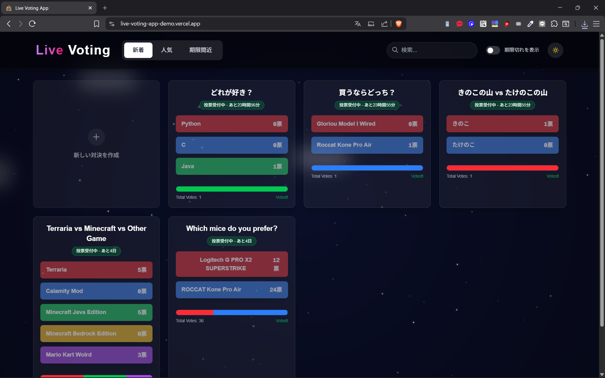
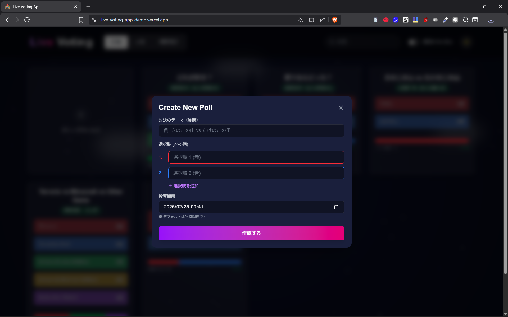
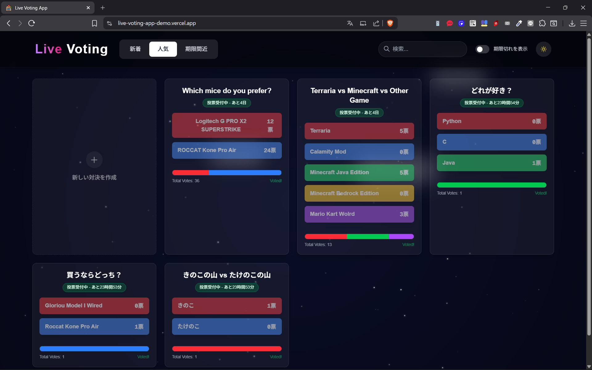
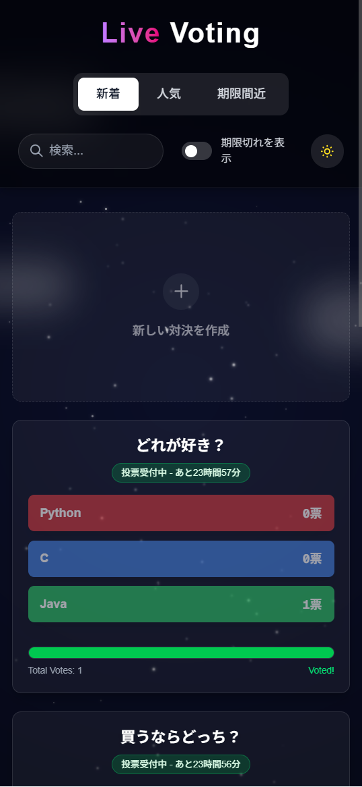
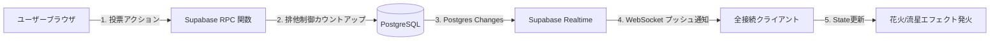

# Live Voting App

**🌐 公開URL**: [https://live-voting-app-demo.vercel.app/](https://live-voting-app-demo.vercel.app/)

---

## 概要
「Live Voting App」は、ユーザーが作成した対決テーマに対して、世界中の人々がリアルタイムで投票・参加できるインタラクティブな投票プラットフォームです。
単に意見を集計するだけでなく、「誰かが投票した瞬間に画面全体が反応する」というライブ体験（UX）を極限まで追求し、視覚的な楽しさと即時性を両立させました。

### 開発の背景・経緯
現代のSNSやアンケートツールでは、意思決定や意見の集約が「非同期」で行われることが多く、「今、この瞬間に意見が交わされ、盛り上がっている」という熱量を感じにくいという課題がありました。
そこで、「簡単にみんなの意見を収集し、一目で全体の傾向がわかる」という実用性に加え、**「ユーザーのアクションが即座に光やアニメーションとなって全ユーザーの画面に波及する」** という、一体感を生み出すウェブアプリを企画・開発しました。

---

## 特徴と機能の説明

### スクリーンショット（ギャラリー）
| トップダッシュボード | 投票作成フロー |
| :---: | :---: |
|  |  |
| **リアルタイム同期と演出** | **検索機能** |
|  |  |
| **ソート機能** | **モバイル表示 (PWA)** |
|  |  |

### 主な機能
*   **ゼロ・ディレイのリアルタイム同期 (SPA)**
    *   ページリロードなしで、世界中の投票結果がプログレスバーに反映されます。
*   **環境連動型バックグラウンド & ライブ・エフェクト**
    *   **Night Sky Mode**: 星空と雲が流れる中、投票発生時に「流星」が流れる演出。
    *   **Fireworks Mode**: 提灯が揺れる夜景を背景に、投票と連動して「花火」が打ち上がる演出。
    *   投票ボタン押下時には `+1` のパーティクルが飛び出し、インタラクションによる手応えを提供します。
*   **高度なダッシュボード機能 (検索・ソート・期限管理)**
    *   インクリメンタルサーチによる「キーワード＆UUID検索」。
    *   「新着順」「人気順」「期限間近順」を瞬時に切り替えるセグメンテッドコントロール。
    *   各投票への「有効期限」設定と、期限切れ一覧の表示トグル機能。
*   **Glassmorphism デザイン & レスポンシブUI**
    *   `backdrop-blur` を用いたすりガラス調のカードUIを採用。背景の美しいアニメーションを透かしつつ、高い可読性を維持しています。
*   **PWA (Progressive Web App) 対応**
    *   スマホやPCのホーム画面にインストール可能。ネイティブアプリのようなシームレスな体験を提供します。

---

## 使用技術 (技術スタック)

### フロントエンド
*   **Framework:** Next.js 15 (App Router)
*   **Language:** TypeScript
*   **Styling:** Tailwind CSS v4 (Glassmorphism, Dashboard Layout `zoom: 0.9`)
*   **Animation:** Framer Motion (AnimatePresence, layout animation)
*   **Font:** Geist Sans / Geist Mono

### バックエンド / インフラ
*   **BaaS:** Supabase (PostgreSQL, Realtime subscriptions)
*   **Deployment:** Vercel
*   **DevOps:** GitHub Actions (Cron Workflow による Keep-alive Ping)

### システム構成図

---

## 開発期間・体制
*   **開発体制**: 個人開発
*   **開発期間**: 2026.01.13 ~ 2026.02.18
*   **総開発時間**: 約 40時間

---

## 工夫した点・苦労した点

### 1. リアルタイム通信の安定化とタイムアウトの克服
開発初期、Supabase Realtime の接続が `TIMED_OUT` で切断され、背景コンポーネントの切り替え時に `CLOSED` 状態に陥る致命的なバグに直面しました。
これに対し、コンポーネントのマウント時に「Math.random() を用いたユニークなチャンネルID」を生成し、アンマウント時のクリーンアップ関数で確実に個別のチャンネルを破棄する（`removeChannel`）設計に変更。さらに RLS（Row Level Security）のポリシーを最適化することで、安定した双方向通信を確立しました。

### 2. トランザクションと排他制御（Race Condition の防止）
投票数のカウントアップにおいて、クライアント側で「取得して+1して保存」する実装では、同時アクセス時に票が消失する「競合」が発生するリスクがありました。
データの完全性を担保するため、**PostgreSQL のストアドプロシージャ（RPC: Remote Procedure Call）** を採用。データベース内部でアトミックな加算処理（`UPDATE ... SET votes = votes + 1`）を行う専用関数 `vote_for_option` を作成し、堅牢なデータ整合性を実現しました。

### 3. DOM描画パフォーマンスとUXの両立
数十個のパーティクル（星、花火、流星）をブラウザ上で滑らかに動かすため、Framer Motion を駆使し、不要になったDOM要素を `<AnimatePresence>` で適切に破棄するメモリ管理を行いました。また、ハイドレーションエラー（Hydration Mismatch）を防ぐためのクライアントサイドレンダリングの制御も徹底しています。

---

## 既知の課題と今後の展望
*   **不正投票防止の強化**: 現在は LocalStorage を用いてブラウザ単位で二重投票を防いでいますが、今後は IPアドレス制限やデバイスフィンガープリント、または匿名認証を導入し、セキュリティを向上させたいです。
*   **シェア機能の拡充**: 投票結果のグラフを OGP 画像として動的に生成し、X（旧Twitter）などで共有しやすくするバイラル機能の追加。
*   **データ可視化**: 投票の推移を時系列の折れ線グラフ（Recharts等を使用）で確認できる詳細分析ページの作成。

